# 基础

## sqlite

Navicat Premium 是 Navicat 的产品成员之一，能简单并快速地在各种数据库系统间传输数据，或传输一份指定 SQL 格式及编码的纯文本文件。

## mysql基础语句

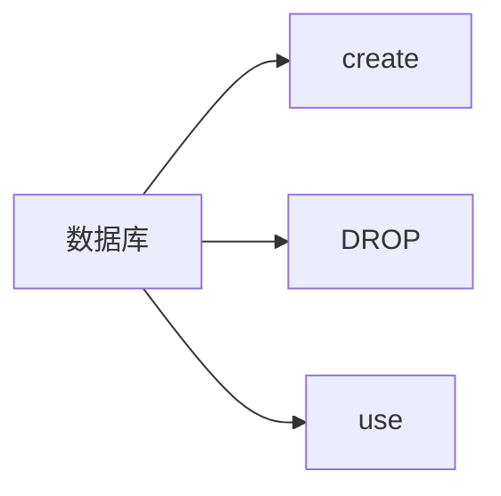

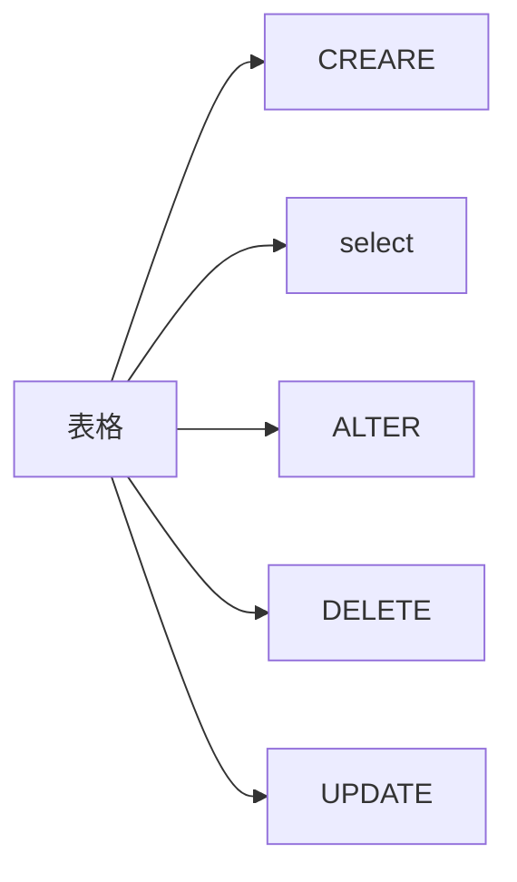

```mysql
create tabel 表名{
	字段1 字段1类型
	字段2 字段2类型
}
```

```mysql
ALTER TABLE emp ADD nickname VARCHAR(20)
```

```mysql
ALTER TABLE emp MODIFY nickname INT//修改数据类型 change效果更大
```

```mysql
alter tabel emp drop usename
```

```MYSQL
UPDATE TABLE USER SET 字段1 = 值1
```


column这个就是一个个的表的列是基础

## 数据权限管理

### 用户管理

用户大全


创建用户
```mysql
CREATE USER 'max'@localhost IDENTIFIED BY '123456'
```

创建用户max 本地主机密码是123456

权限是本地主机

任意主机统配符

```mysql
CREATE USER 'ki'@'%' IDENTIFIED BY '123456'
```

删除用户

```mysql
DROP USER 'ki'@'%'
```

### 权限控制

mysql权限验证过程

先从user表hose user password判断链接是否存在

grant就是指权限


查询权限、

```mysql
SHOW GRANTS FOR 'root'@'localhost'
```

授予权限

```mysql
GRANT ALL ON cat.* TO 'root'@'localhost'
```

中间是权限的数据库

数据的类型


检查不重复的行

**distinct**

语法

```mysql
select distinct id from cat
```

修改表名

```mysql
ALTER TABLE emp RENAME TO empy
```


## 约束

### primary	 key

power:

```html
can be the noly one to make you know 

where is you are

for exm.

there are thousands of datas ,only by the primary key, can you find the 

position you want
```


作用在表中字段的规则

主键的作用：

约束唯一的定义

一定要满足

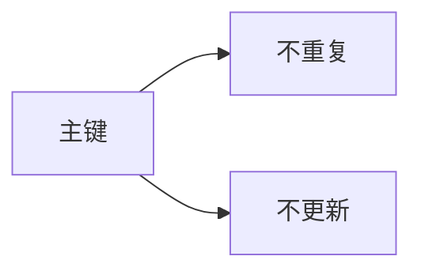

约束大全


约束演示

记得写注释

comment ‘内容'

add step by step

```mysql
CREATE TABLE USER
(
	id  INT AUTO_INCREMENT PRIMARY KEY,
	
)
```

***外键约束***

外键是两个表格之间的链接

外键是从表

主键是主表

作用：数据的完整性，在删除的时候又可以保证数据的一致性

如果不然在程序运行的时候，需要大量的时间去搜索，浪费时间而且会触发并发操作，可能造成死锁

添加

```mysql
ALTER TABLE student ADD CONSISTENT fk FOREIGN KEY(dress_id) 
REFERENCES address(addressid)
```

删除

```mysql
alter table studetn frop foreign key fk
```

### 外键删除和更新


外键关联的是员工表的主键

外键注意点：

1、A 和B必须都是支持外键的引擎，如INNODB引擎。 
2、ID 和AID 类型必须一致（如果是数值类型，如一种是int，一种却是tinyint，这样属于不一致；但如果一种是unsigned，一种是非unsigned，则其数据类型也属于不一致的；同一类型但长度却不一样：一种是varchar(10)，而另一种是varchar(5)，这也是属于不一致的......等等）。 
3、ID 必须是KEY. 
4、foreign key 的名字必须在整个库是唯一的。
5、字符集要一致。
6、已有表记录的，检查表记录是否存在不符合条件的记录。

外键的话需要对子表进行一个加锁的动作，加大查询消耗

于是就不得不使用触发器来进行操作


外键关联主键

例子：

```mysql
create table user(
    id int primary key auto_increment,
    name varchar(10) not null unique,
    age int check(age > 0 and age < 120),
    status char(1) default '1',
    gender char(1)
);
```

add freogin key

```mysql
CREATE TABLE 表名(
    字段名 字段类型,
    ...
    [CONSTRAINT] [外键名称] FOREIGN KEY(外键字段名) REFERENCES 主表(主表列名)
);
ALTER TABLE 表名 ADD CONSTRAINT 外键名称 FOREIGN KEY (外键字段名) REFERENCES 主表(主表列名);
-- 例子
alter table emp add constraint fk_emp_dept_id foreign key(dept_id) references dept(id);
```


the method of it

```mysql
ALTER TABLE student ADD CONSTRAINT FK_ID FOREIGN KEY(dress_id) REFERENCES address(addressid)
```


### 外键报错原因常见总结

**外键字段类型不匹配**

假如 A.b_id 定义的是`int` 类型，而 B.id 却是 `varchar` 。 向A新增数据时就会报这个错。

那么 统一类型 即可解决问题。

**外键没有添加这个数据**

外表中没有这个新的数据

插入数据的步骤：

A.添加主表的数据

b.添加从表的数据

### update and delect

前面2个是默认行为

update

```mysql
ALTER TABLE student ADD CONSISTENT fk FOREIGN KEY(dress_id) 
REFERENCES address(addressid) ON UPDATE CASCADE
```

 

函数


**select + function**

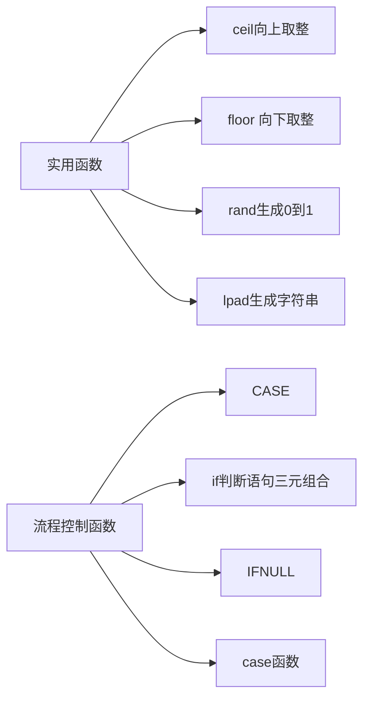

生成随机验证码

一个是生成问题

一个是填充问题

填充问题就利用lpad函数

lpad再写入悬停的时候可以看到参数

case

```mysql

SELECT s_name,
(CASE s_sex WHEN '男' THEN 'man'
ELSE 'woman' END)AS '工作地址'
FROM student

```


### 起别名 

as


-----------------------------------------------------------------------------------------------------------

# 进阶

## 表格设计

### 表格关系

一对多

在多的一方的一方添加外键，指向一的一方主键


表格设计需要解耦合

**1：n**

在n的一方加入外键

好处

1，多的一方插入可以有部门无员工，但是不能有员工无部门

先主后从，先对主表操作，意味着如并须有部门才可以有员工，这就是同步问题

2，可以限制和表示一对多的关系

限制一个员工在多个部门

口诀

***先主后从，限制在多，一个对一个***

**n:n**

多对多操作

一个对一个


多对多的时候，就是一个外键和另一个外键

先建立谁都不合适

需要用一个中间的表来过渡

创建这样

```mysql
CREATE TABLE book2author
(
	id INT PRIMARY KEY AUTO_INCREMENT,
	book_id INT,
	FOREIGN KEY(book_id) REFERENCES book(id) ON UPDATE CASCADE ON DELETE CASCADE,
	author_id INT,
	FOREIGN KEY(author_id) REFERENCES author(id) ON UPDATE CASCADE ON DELETE CASCADE
)
```


这样的中间表格就可以进行过渡

中间这个表格就可以进行过渡

一对一的表格就直接nf拆分

通过外键来关联另一个表格的主键

在外键加入unique关键字


### 三大范式

不满足范式到后期会带来数据的冗余和复杂化

以及更多的磁盘消耗

加入太多的范式会有关联冗余，

阿里巴巴的开发手册就是禁止3个表的join


例子示例图


外键的一对一可以实现同时的删除


先主后从

笛卡尔积（会增加消耗的内存和查询时间，多表查询的时候一般都要减少多个表的join查询）

### 表格设计规范

1）设计表时要注意：

- 表字段避免 null 值出现，null 值很难查询优化且占用额外的索引空间，推荐默认数字 0 代替 null。
- 尽量使用 INT 而非 BIGINT，如果非负则加上 UNSIGNED（这样数值容量会扩大一倍），当然能使用 TINYINT、SMALLINT、MEDIUM_INT 更好。
- 使用枚举或整数代替字符串类型
- 尽量使用 TIMESTAMP 而非 DATETIME
- 单表不要有太多字段，建议在 20 以内
- 用整型来存 IP
- 索引并不是越多越好，要根据查询有针对性的创建，考虑在 WHERE 和 ORDER BY 命令上涉及的列建立索引，可根据 EXPLAIN 来查看是否用了索引还是全表扫描
- 应尽量避免在 WHERE 子句中对字段进行 NULL 值判断，否则将导致引擎放弃使用索引而进行全表扫描
- 值分布很稀少的字段不适合建索引，例如 "性别" 这种只有两三个值的字段
- 字符字段只建前缀索引
- 字符字段最好不要做主键
- 不用外键，由程序保证约束
- 尽量不用 UNIQUE，由程序保证约束
- 使用多列索引时主意顺序和查询条件保持一致，同时删除不必要的单列索引

### io图标设计

可以使用draw.io软件进行设计

## mysql服务器架构

### lock

业务图的逻辑类似是如下面：

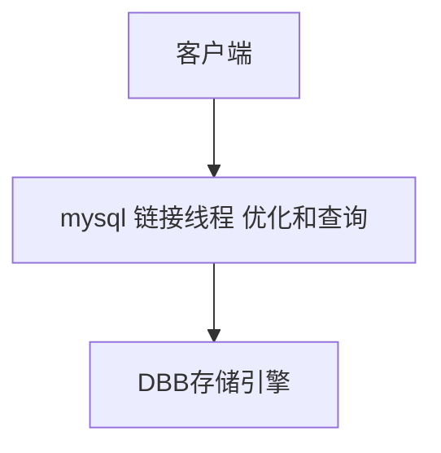

申请加入并发锁和排他锁

读锁是共享的，大家可以一起读，读，

写的时候就要排他

加锁只加到需要的部分数据片上

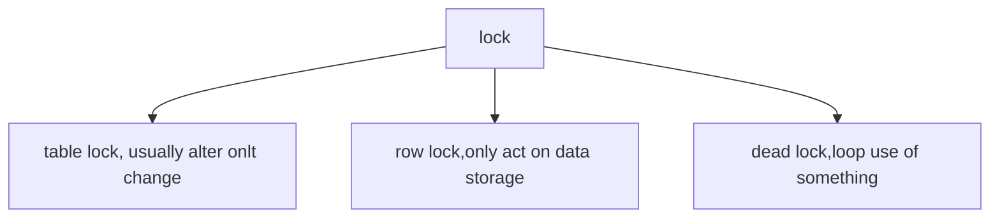

### trsaction

a set of sql which is Atomicity

dirty read


dead lock


second use id =3 and first also use second

run the transaction run back can solve this problem

the problem will be like under show:

查看全局的隔离级别：

```mysql

 SELECT @@GLOBAL.transaction_isolation;
```

设置隔离级别：

```mysql

SET GLOBAL TRANSACTION ISOLATION LEVEL READ COMMENT;
```

读提交。只读提交后面的事务，就到达了不可见的事务。


**for the data ,He takes two write-backs to ensure security and efficiency**

### test

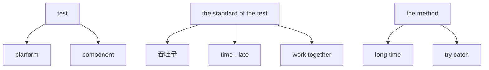

建立起shell脚本把每次的测试数据放到目录中去：


特点

1.sleep迭代时间，一般都会大于t秒

2.写一些脚本来抓取数据测试的时间点

## 多表查询

### 基本概念

多表查询需要需要的缺点就是会有个笛卡尔积的问题

**笛卡尔积**

在一个表格中选择一个类型，同时在另一个选择另一个

就是a中选择一个在另一个选择b

就会有如下的情况


要加上条件来进行删选

这个条件就是两个表格之间关联的字段

多表查询分类


tips : 

alias  the table 

外链接：

左外（一个是复合条件的加上一个左边的表格）

右外（复合条件加上一个右边的表格）


```mysql
SELECT * FROM student RIGHT OUTER JOIN address 
ON student.`dress_id`=address.`addressid`
```

自链接

要起别名

联合查询union all

```mysql
ALTER TABLE student ADD stu_year INT DEFAULT(20)
INSERT INTO student(s_name,s_sex,stu_year,s_id)
VALUES('liu','男',30,100)
SELECT * FROM student WHERE s_sex='男' 
UNION ALL 
SELECT * FROM student WHERE stu_year > 20
 
```

一个结果放在上面一个放在下面

但是会有问题如下：


重复了，这个就是问题

union就是合并后进行去重

联合特点：

1.有all不去重，没all去重

2.union就是联合，只能是复合select*这种就是可以的


### ***子查询***

就是一个查询嵌套另一个查询就是套娃

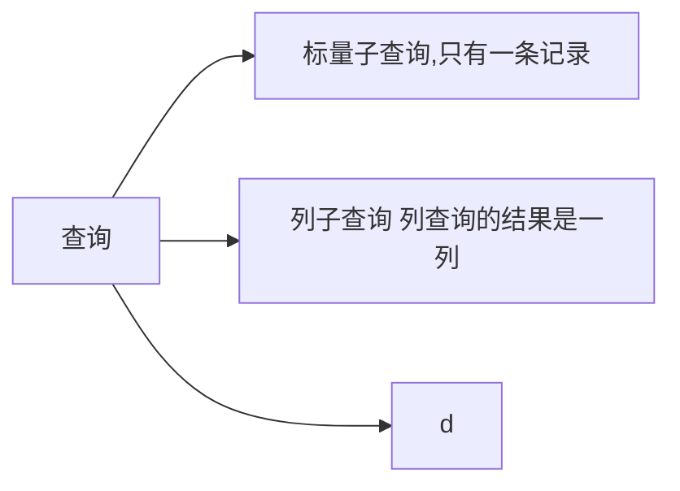

列子查询


# 架构

## 1事务

是一组并发的原子性sql语言

## 2.基本操作（operation）

mysql使用@来查看变量


出现异常就回滚事务，没出现异常就提交事务

减少数据的

事物的操作：

可以用begin来开始事务

```mysql
BEGIN 
SELECT * FROM account WHERE NAME = '张三';
UPDATE account SET money = money - 1000 WHERE NAME = '张三';
error
UPDATE account SET money = money + 1000 WHERE NAME = '李四';
COMMIT;
```

事务的四大特性：

原子性（都是同一个操作）

一致性（数据要保持一致）

隔离性（数据之间是互相lock的，row lock）

持久性（就是数据回回写到一个连续的stack中，然后慢慢地回写回去）

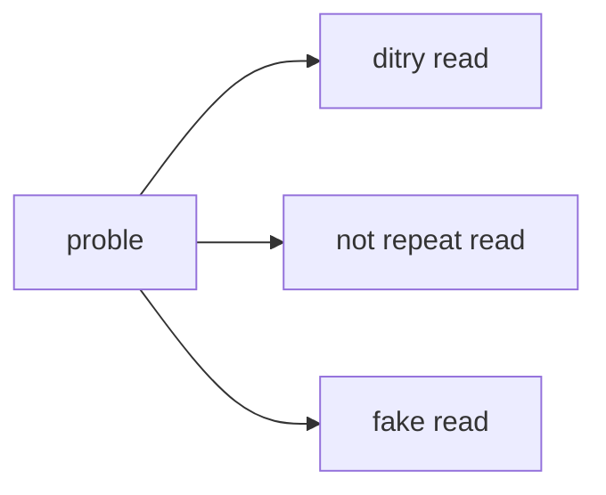


## 3.四个隔离级别

修改隔离级别

```mysql
set session transaction isolation level 级别名称
```

低级的隔离级别越支持高并发，性能好（maybe is because no need lock）

事务就是可见和不可见的差别

不可重复读：（同一个事务内的数值不一样）


幻读（两次的事物读取出来不一样，原因是一个事任务可能修改了某部分的数值）


可串行化（每个都是串行）

引起大部分的互相增添lock 浪费效率

# mysql性能提高

## 1.范式和反范式

一般这个范式就是填写表格

表格的话就是如下这样


这个表格的范式错误在与


左边的就是主键


右边的h推不出全集不算是主键

于是等到候选码为（e,d)

满足第一范式

接下来考虑是否满足第二范式

就是删除部分依赖，d可以完全推出h

所以h是部分依赖，就要拆开表格


拆开表格即可


## 2.alter table speed improve


创建一个新表，重命名

alter的逻辑:修改旧表然后创建新表

修改frm文件：


## 3.索引

建立语句：

```mysql
CREATE  INDEX idx_emp_job ON  emp(job_id);
```

index 前面可以加入修饰符primary key等等

**聚集索引下面是数据行，二级索引下面是数据的id**

加入索引能使得查询更加高效

效率高，占用空间小

索引表要维护一张表

外键一定要建立索引


采用b+ tree 从根结点开始索引，减少了查询的事件

主键索引 primary key

唯一索引 unique

全文索引 full text

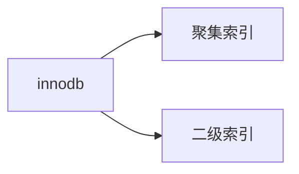

主键就是聚集，primary key就是聚集

unique就是唯一索引

建立索引的语法：


聚集就是行元素

二级是无冗余

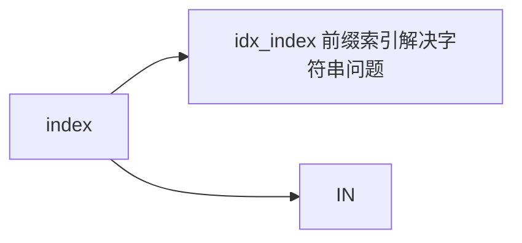

前缀索引：
```mysql
create index k on emp(emp_id（column(n))
```

这个就是构造前面几个为索引

## 4.高性能效率mysql测试工具

查看索引的查询效率

```mysql
SHOW GLOBAL STATUS LIKE 'com_______';
```

to show the status of the mysql; 

make mysql more effctive;

```mysql
```


查看profile文件来保证效率

start up profiling:

```mysql
set profiling = 1;
```


查看profile文件的语句；

```mysql
show profile;
```

查看运行的过程

```mysql
explain select * from student;
```


strace（os里面）

类似的在mysql里面就是

（explain）


**一个法则：最左前缀法则**

another problem---slow sql

it just like :

if you try to yun some sql,and then the mysql yun is becoming slow.

it must be a problem in there,so you must solve the problem there may be have.

## 5.建立索引的原则

大量查询的

尽可能做联合

区分度高的作为索引

用覆盖索引，避免回表查询

## 6.视图

视图是一个虚拟表，是用来可视化

创建视图语句：

```mysql

CREATE VIEW ename_id_salary AS SELECT ename,salary 
FROM emp;
```

查询视图

```mysql
select * from view_name;
```

视图查询的底层算法


视图可以处理处理数据表中的安全权限问题，能够使得数据库不更改在原表，在视图上面进行修改安全又方便

修改视图：

```mysql
ALTER VIEW ename_id_salary AS SELECT ename,id FROM emp;
```

使用视图可以用来改变表的权限，而不去增加，能够使得地下的性能有所提升

with check option

cascade 和 local

cascade（级联）

## 7，存储过程

复用可提升

减少网络交互，效率提升


存储过程可以增加底层的集合内部过程函数

以及能够使得访问更加规范，业务逻辑更好

调用使用call来调用：

```mysql
call function_name();
```

创建存储过程：

```mysql
DELIMITER $$

CREATE
    /*[DEFINER = { user | CURRENT_USER }]*/
    PROCEDURE `test`.`find_salary`()
    /*LANGUAGE SQL
    | [NOT] DETERMINISTIC
    | { CONTAINS SQL | NO SQL | READS SQL DATA | MODIFIES SQL DATA }
    | SQL SECURITY { DEFINER | INVOKER }
    | COMMENT 'string'*/
    BEGIN
	SELECT ename,salary 
	FROM emp;
    END$$

DELIMITER ;
```

在cmd中要用**dilimiter$$**表示结束

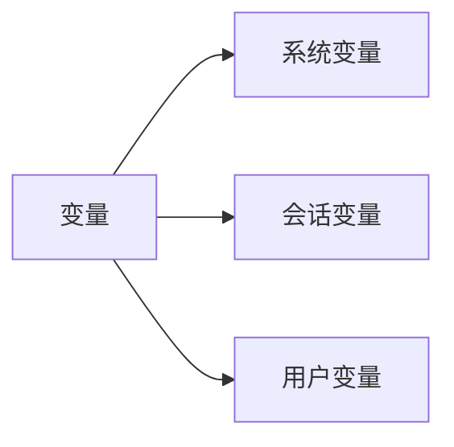

check 

```mysql
SHOW GLOBAL VARIABLES;
```

用户变量

```mysql
 set @var_name:=1;
```

查看用户变量，用select

```mysql
SELECT COUNT(*) INTO @nihao FROM emp;
```

查看局部变量,范围在begin 和end里面

```mysql
declare nihao int default 0;
```

